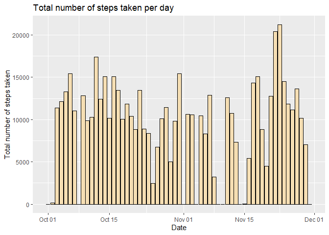
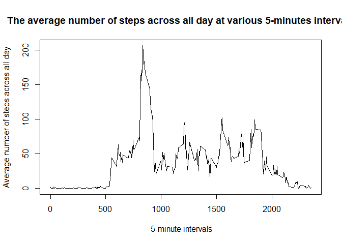
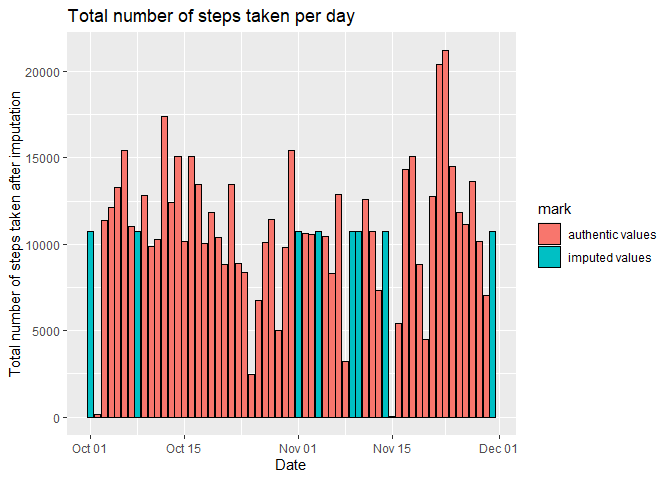
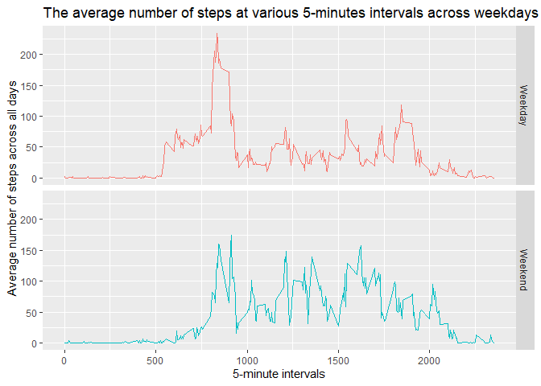

Loading and preprocessing the data
===================================

### Load the data


```r
# Download the zipped data set as a temporary file
fileURL <- "https://d396qusza40orc.cloudfront.net/repdata%2Fdata%2Factivity.zip"
temporary <- tempfile(pattern = "activity", fileext = ".zip")
download.file(fileURL, temporary, method = "curl")

# Load the data into  R
activity <- read.csv(unz(temporary,"activity.csv"))

# Remove the temporary file
unlink(temporary)
```

### Transform the data

```r
# Transform to Date data type (from Factor)
activity$date <- as.Date(activity$date, format = "%Y-%m-%d")
```

### Load any relevent packages

```r
library(ggplot2)
library(tidyverse)
```

What is mean total number of steps taken per day?
===================================================

### Calculate the total number of steps take per day

```r
TotalStep <- group_by(activity, date) %>% summarise(totalsteps = sum(steps, na.rm = T))
```

### Make a histogram of the total number of steps taken each day


```r
ggplot(data = TotalStep, aes(y = totalsteps, x = date)) + geom_histogram(stat = "identity", fill = "wheat", colour = "black") +
  xlab("Date") + ylab("Total number of steps taken") +
  ggtitle("Total number of steps taken per day")
```

<!-- -->

### Calculate and report the mean and median of the total number of steps taken per day


```r
round(mean(TotalStep$totalsteps),1)
```

[1] 9354.2

```r
round(median(TotalStep$totalsteps),1)
```

[1] 10395

- The mean and the median of the total number of steps take per day are 9354.2 steps and 10395 steps, respectively.

What is the average daily activity pattern?
============================================

### Make a time series plot of the 5-minute interval and the average number of steps taken, averaged across all days 


```r
TimeSeries <- group_by(activity, interval) %>% summarise(averagesteps = mean(steps, na.rm = T))
with(TimeSeries,plot(x = interval, y = averagesteps, type = "l", xlab = " 5-minute intervals", ylab = "Average number of steps across all day", main = ('The average number of steps across all day at various 5-minutes intervals')))
```

<!-- -->

### Specify the 5-minute interval containing the maximum numbers of steps


```r
MaxStepInterval <- TimeSeries$interval[TimeSeries$averagesteps == max(TimeSeries$averagesteps)]
```

- 5-minute interval with the maximum number of steps is at the 835 minute. 


Imputing missing values
=========================

### Calculate and report the total number of missing values in the dataset


```r
missing <- sum(!complete.cases(activity))
```

- The total number of missing values in variable `steps` is 2304.

### Create a new dataset that is equal to the original dataset but with the missing data filled in


```r
# Generate the identical data set
imp_activity <- activity

# Calculate the average number of steps at various intervals, averaged across all days
MeanStepByInterval <- group_by(activity, interval) %>% summarise(averagesteps = mean(steps, na.rm = T))

# Mark values with "imputed values"

imp_activity$mark[!complete.cases(activity)] = "imputed values" ; imp_activity$mark[complete.cases(activity)] = "authentic values"

# Replace NA values with referenced values at various intervals
for (i in seq_len(nrow(activity))) {
  if (is.na(activity$steps[i])) {
    imp_activity$steps[i] = MeanStepByInterval$averagesteps[MeanStepByInterval$interval == activity$interval[i]]
  }
}
```

### Calculate the total number of steps take per day AFTER IMPUTATION


```r
imp_TotalStep <- group_by(imp_activity, date,mark) %>% summarise(totalsteps = sum(steps, na.rm = T))
```

### Make a histogram of the total number of steps taken each day AFTER IMPUTATION


```r
ggplot(data = imp_TotalStep, aes(y = totalsteps, x = date, fill = mark)) + 
  geom_histogram(stat = "identity", colour = "black") +
  xlab("Date") + ylab("Total number of steps taken after imputation") +
  ggtitle("Total number of steps taken per day")
```

<!-- -->
### Calculate the mean and median total number of steps taken per day AFTER IMPUTATION


```r
round(mean(imp_TotalStep$totalsteps),1)
```

[1] 10766.2

```r
round(median(imp_TotalStep$totalsteps),1)
```

[1] 10766.2

- The mean values after missing data imputation is 10766.2 steps, which is higher than 9354.2. Also, the mean after imputation is 10766.2 steps and higher than the previous median, 10395. The imputation has increased the summary estimates and made them into unity.

Are there differences in activity patterns between weekdays and weekends?
=========================================================================

### Create a new factor variable


```r
# Generate two strings of characters of weekdays and weekend
weekday <- c("Monday","Tuesday","Wednesday","Thursday","Friday")
weekend <- c("Saturday","Sunday")

# Create the factor variable
activity$week <- vector(mode = "character", length = nrow(activity))
activity$week[weekdays(activity$date) %in% weekday] = "Weekday"
activity$week[weekdays(activity$date) %in% weekend] = "Weekend"
```

### Plot a time-series


```r
TimeSeries <- group_by(activity, interval,week) %>% summarise(averagesteps = mean(steps, na.rm = T))

ggplot(data = TimeSeries, aes(x=interval, y = averagesteps, colour = as.factor(week))) + 
  geom_line() + facet_grid(as.factor(week) ~ .) + theme(legend.position = "NULL") + 
  xlab("5-minute intervals") + ylab("Average number of steps across all days") + 
  ggtitle("The average number of steps at various 5-minutes intervals across weekdays or weekend")
```

<!-- -->


